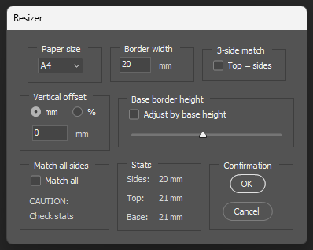

# Purpose

# Installation

Run the script within Photoshop. If you usually change colour space before final output, I suggest changing the colour space prior to running the script, otherwise the borders may not be maximally white.

# Options
 
 

## Option 1